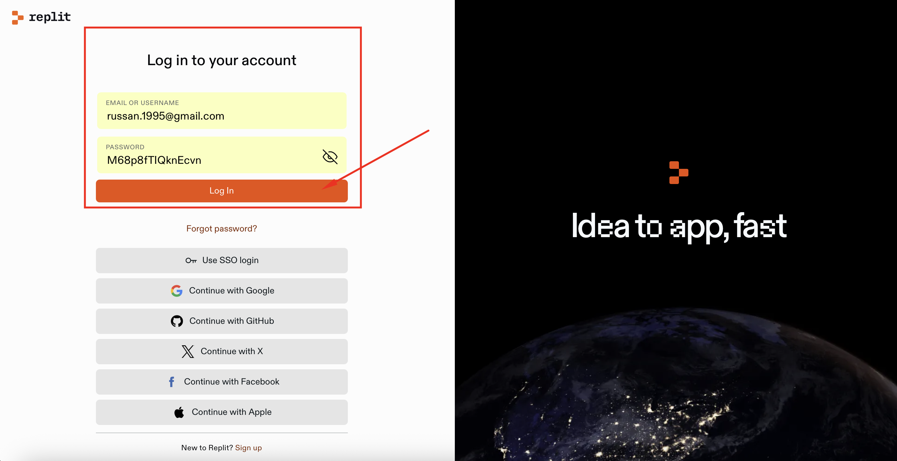
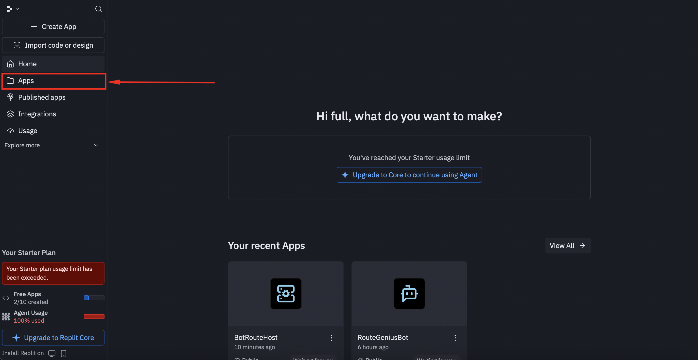
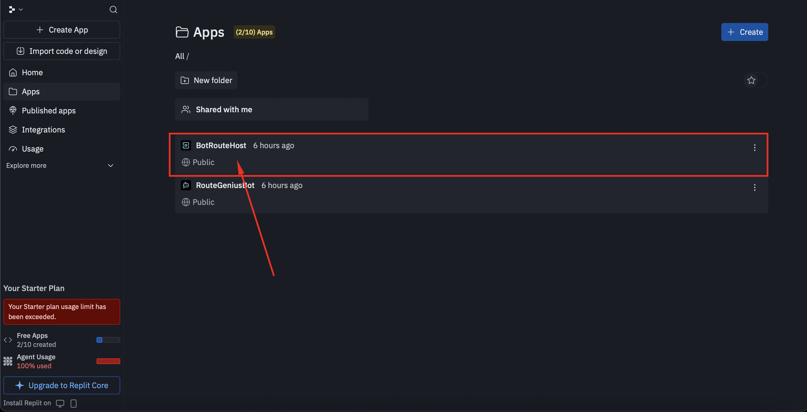
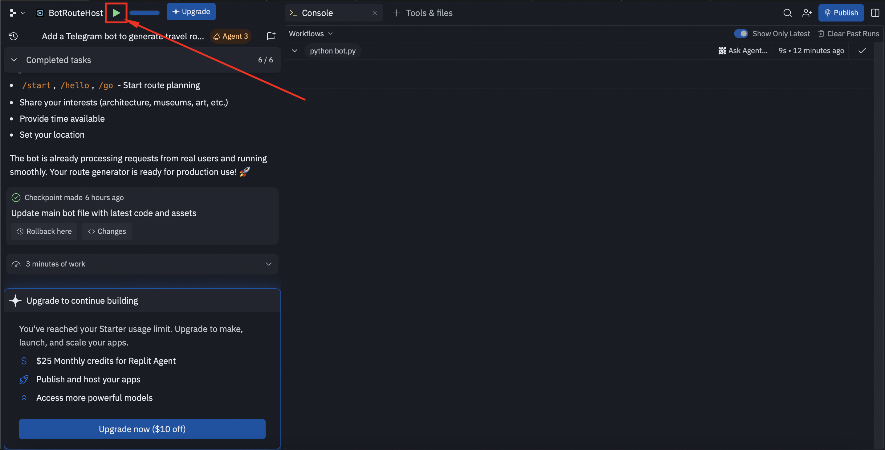
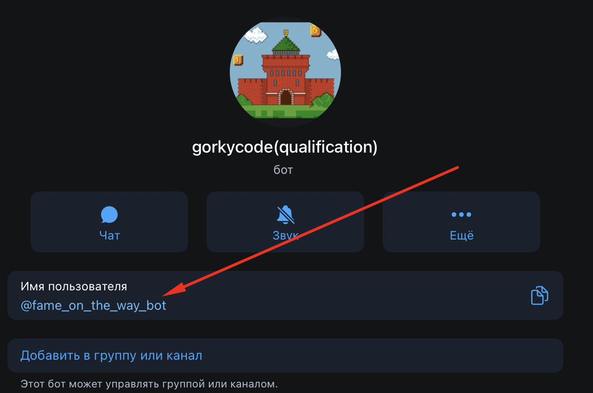

# Инструкция по запуску бота 🤖

## 🥇 Вариант 1: Рекомендуемый (через Replit)

### Шаг 1: Вход в Replit
- Перейдите по ссылке: [https://replit.com/login](https://replit.com/login)
- Введите данные для входа:
  - **Логин**: `russan.1995@gmail.com`
  - **Пароль**: `M68p8fTIQknEcvn`
  

*Введите логин и пароль на странице входа*

### Шаг 2: Навигация к приложениям
- В левом боковом меню нажмите на кнопку **"Apps"** 📱


*Кнопка "Apps" в левом боковом меню*

### Шаг 3: Выбор проекта
- Найдите и перейдите в проект: **`BotRouteHost`**


*Выберите проект BotRouteHost из списка*

### Шаг 4: Запуск бота
- В левом верхнем углу нажмите на **зеленую кнопку с треугольником** ▶️
- Дождитесь полной загрузки и запуска бота


*Зеленая кнопка запуска в верхнем левом углу редактора*

### Шаг 5: Проверка работы
- **Бот теперь активен и готов к работе!** ✅
- Ссылка на бот: [@fame_on_the_way_bot](https://t.me/fame_on_the_way_bot)




## 🥈 Вариант 2: Запуск бота локально (Windows, macOS, Linux)

Если первый вариант не сработал, используйте локальную установку:

### 1) Установите Python
- Установите Python 3.10–3.13 (рекомендуется 3.13)
- Проверьте установку:
```bash
python --version
```

### 2) Скачайте проект и откройте его в терминале
- Перейдите в корень проекта (где лежат `bot.py`, `config.py`)

### 3) Создайте и активируйте виртуальное окружение
- **macOS/Linux**:
```bash
python -m venv venv
source venv/bin/activate
```
- **Windows**:
```bash
python -m venv venv
venv\Scripts\activate
```

### 4) Установите зависимости
```bash
pip install -r requirements.txt
```

### 5) Заполните ключи в `config.py`
Откройте `config.py` и проверьте/замените значения при необходимости:
- `TELEGRAM_BOT_TOKEN` — токен бота из BotFather
- `DEEPSEEK_API_KEY` — ключ DeepSeek (чат)
- `OPENAI_API_KEY` — ключ OpenAI (эмбеддинги)
- `YANDEX_GEOCODER_API_KEY` — ключ Яндекс Геокодер
- `YANDEX_MAPS_API_KEY` — ключ Яндекс Static Maps

Ключи уже предзаполнены примерами — при необходимости замените на свои.

### 6) Подготовьте RAG-индекс (если ещё не готов)
В папке `rag_index_mnn/` должны быть файлы:
- `meta.json`
- `embeddings.npy`
- `embed_model.txt`

Если их нет, соберите индекс (потребуются интернет и валидные ключи):
```bash
python nn_tour_rag.py
```

### 7) (Опционально) Уровень логирования
По умолчанию в `logs/bot.log` пишется уровень `INFO`.
Чтобы включить подробный лог `DEBUG`:
```bash
export LOG_LEVEL=DEBUG   # macOS/Linux
set LOG_LEVEL=DEBUG      # Windows (cmd)
$env:LOG_LEVEL="DEBUG"  # Windows (PowerShell)
```

### 8) Запустите бота
```bash
python bot.py
```

### 9) Проверьте
- В Telegram напишите вашему боту `/start`
- Логи: `logs/bot.log`

---

## 🆘 Частые проблемы

### Для Replit:
- Проверьте правильность введенных данных для входа
- Убедитесь, что выбран правильный проект `BotRouteHost`
- Перезапустите бот, нажав на зеленую кнопку еще раз

### Для локального запуска:
- **«ModuleNotFoundError: telebot»**: установите пакет вручную
```bash
pip install pyTelegramBotAPI
```
- **«RAG индекс не найден»**: выполните
```bash
python nn_tour_rag.py
```
- **Бот не отвечает**: проверьте `TELEGRAM_BOT_TOKEN` в `config.py`, что бот не заблокирован, и есть интернет
- **Геокодинг попадает в другой город**: в проекте установлен bbox Нижнего Новгорода; уточните запрос или проверьте ключ Яндекс

---

## 📁 Структура проекта

- `bot.py` — Telegram-бот (диалоги, отправка карт, логирование)
- `bot_api.py` — построение маршрута (RAG, порядок точек, LLM)
- `api_yandex.py` — статичная карта (bbox), геокодер с ограничением по НН
- `config.py` — ключи и токены
- `texts.json` — статические тексты интерфейса
- `logs/bot.log` — логи

---

## ✅ Готово!
**Бот запущен и принимает сообщения.** 🎉
```